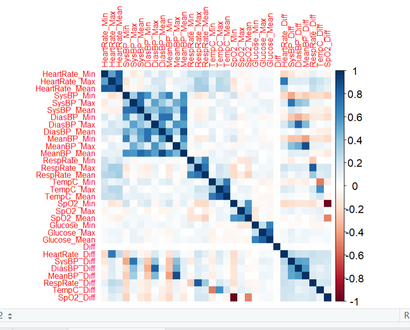
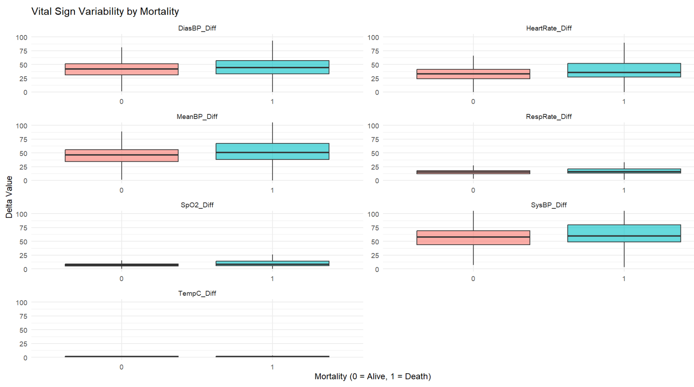
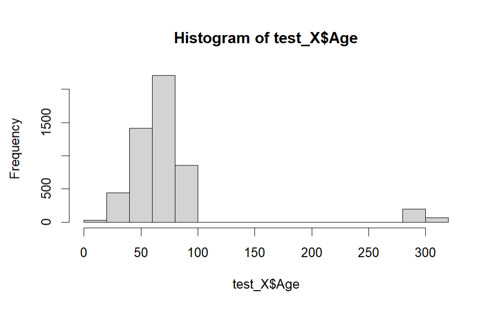

# icu-mortality-prediction
Predicting probability of death in an ICU 

# 1. Introduction 
## 1.1 Background 

Intensive Care Unit (ICU) admissions have increased considerably in the last decade. Early prediction of ICU mortality is crucial, as the critically ill tend to deteriorate rapidly and often without obvious early signs. Medeiros's study also identified patients that remain poorly characterized tends die within the first 24 hours following ICU admission. Accurately identifying high risk patients within the first ICU admission will enable: 
* Proactive decision making 
* More efficient resource allocation
* Reduction of preventable mortality

Machine learning has now also been increasingly used in critica care prediction tasks. 
## 1.2 Objective 

* Preprocess the dataset to build several predictive machine learning (with binary classification outcomes)
* Comparing accuracy of traditiional statistical models (Logistic Regresson) with more advanced machine learning models (Randon Forest, XGBoost)
* Evaluate model performance 

## 1.3 Scope and Limitation 

The dataset will be restricted to Medical Information Mart for Intensive Care III (MIMIC-III) derived cohort. It is an open source database comprising of deidentified health data associated with over forty thousand patients living in critical care units of Beth Israel Deaconess Medical Center between 2001 and 2012. The dataset includes key vital signs, diagnosis and general characteristics (age, gender) and clincial outcome (mortality) of each patient. More deails can be found under _mimic_patient_metadata.csv_

# 2. Data 
## 2.1 Data Source 

The dataset comprised of a combination of various tables found in the [MIMIC website](https://mimic.mit.edu/docs/iii/tables/) (There is currently a more updated version available). The database includes information on demographics, vital signs measurements, test results, ICD codes, mortality status amongst others. 

## 2.2 Outcome Variable 
* HOSPITAL_EXPIRE_FLAG (0 = survived, 1 = died)
  
## 2.3 Predictor variables: 
Identifiers: `subject_id`, `hadm_id`, `icustay_id`
Physiology: `HeartRate`, `SysBP`, `DiasBP`, `RespRate`, `TempC`, `SPO2`, `Glucose` 
Demographics: `GENDER`, `DOB`, `INSURNACE`, `RELIGION`, `MARITAL_STATUS`
Diagnosis: `Diagnosis`, `ICD9_diagnosis` 
Others: `ADMITTIME`, `DIFF`, `ADMISSION_TYPE`, `FIRST_CAREUNIT`

## 2.4 Train- Test Dataset Split 
Test- 5,221 observations
Train- 20, 855 observations

## 3. Initial Data Exploration 

### 3.1 Data Cleaning 
* There is a class imbalance in the dataset (11% mortality rate)
* There are no missing values in the dataset

### 3.2 Handling categorical variables 

A general rule of thumb (10) has been set to determine if a variable was at risk for high sparsity. High cardinality variables creates very sparse, huge matrices, and will result in overfitting, along with making modelling unstable. All categorical variables with the exception of `Diagnosis` have <10 cardinality.

Two methods were explored to manage `Diagnosis`: 
1. Target encoding  
Mortality rate will be computed for each ICD-9 diagnosis group. However, there are some very common ICD groups (common diseases with thousands of patients), and some that are very rare (rare diseases with only 1-5 patients). Naively computing the mortality rate as (number of deaths/ number of cases) will give very extreme and unreliable values. I will be solving this issue with *Laplace Smoothing*, to prevent noise from rare categories skewing the model. The average death rate is calculated as the baseline mortality rate (number of deaths/ total number of patients), to be used as the  prior belief. A weight of 2 is assigned to the average death rate, meaning that each ICD group is given +2 extra virtual patients. This ensures that the rare ICD9 codes are not given extreme rates due to a small sample size. The smoothed rate (posterior) will now be (deaths + 2 * average death rate)/ (number of cases + 2)

3. Regex  
Keyword matching pattern was used to group diagnosis into broader categories (e.g. 'resp|pneumon|bronch under 'Respiratory' conditions). Conditions with a frequency count of >20 was left as it is, and unmatched conditions were grouped under 'Rare diseases'.
Overall, I achieved a 75% reduction in cardinality- but still had significant number of 130 diagnosises uncategorised. Therefore, the target encoding methodology will be used instead.  

### 3.3 Exploring numerical variables 

#### Multicollinearity
A correlation matrix was created to display a heat map of variables with high correlation.  

Findings: 
* Strong within modal correlations for Min, Max and Mean values of each vital signs (especially for blood pressure, heart rate). These clusters indicate high redundancy, as the measures reflect the same underlying physiogic processes
* There is little correlation between different vital sign families (heart rate does not correlate with BP, nor spo2. temperature does not correlate with anything). This suggests that the vital signs changes independently. 
* Engineered instability features (Difference between min and max values) exhibits a weaker correlation with their corresponding Min/ Max/ Mean values, suggesting that they are able to contribute new information to the model. These findings support the inclusion of these engineered instability features.

Variables with a collinearity value of >0.8 will be dropped, as they are redundant and will not be able to provide the model with additional information.

#### Max- min variability  
Max- min differences in vital signs was used to quanity physiologic instability (bigger swings in vital signs tend to occur more in critical conditions). Althought not a formal feature selection method, physiological instability can guide explanability when used alongside model based feature importance methods. 

Findings: 
* Across most vital signs, patients who died (Mortality = 1) shows a larger variability, a pattern consistent with clinical expections (physiologic instability being associated with mortality risk) 
* Box plots of heart rate, blood pressure and oxygen saturation demonstrated clear differences between survivors and non- survivor (as shown with longer box whisker tails). 
* Both groups show minimal variability in temperature (Temperature in the ICU is tightly controlled, and tends not to fluctuate).

Overall, patterns indicate that greater physiologic fluctuations and instability early on in the ICU stay is associated with increased mortality risk. This supports the inclusion of instability based features in the model. 

### 3.4 Feature Engineering 

#### 3.4.1 Categorisation of age 
As age is not explicitly given, it is calculated as the difference between the ADMIT TIME and DOB. There is an outlier of >300 years, and will be removed. 

#### 3.4.2 One- hot encoding of categorical variables (model matrix)
One hot enoding was performed using `model.matrix()` to convert categorical variables into a set of binary indicator columns. This transformation is required as machine learning models requires numeric inputs and is unable to inter[ret categorical text variables directly. 

#### 3.4.3 Standardisation of numeric variables 
All numeric predictors were standardised using z- score normalisation. For each variable, the mean and standard deviation were computed from the training set, and used to transform both the training and testing set. This ensures each predictor has a mean of 0 and standard deviation of 1. Standardization was done to ensure comprability between different predictors and support algorithms sensitive to variable scale. 

# Analysis 
### 4.1 Modelling Approach 
* Baseline: Logistic Regression
* Tree- base: Random forest, XGBoost

### 4.2 Model training 
* Handling class imbalance
* Cross validation
* Hyperparameter tuning

### 4.3 Model evaluation 
* AUC- ROC
* Precision, recall, F1
* Confusion matrix

### 4.4 Results summary
  
# 5. Discussion 
### 5.1 Interpretation of findings 
* key predictors
* difference in predictors across models

### 5.2 Strengths 
* model performance?
* sufficient sample size?
* comprehensive feature engineering?
* handling of imbalanced class?

### 5.3 Limitations 
* generalisation? risk of over fitting

### 5.4 Future work and direction 
